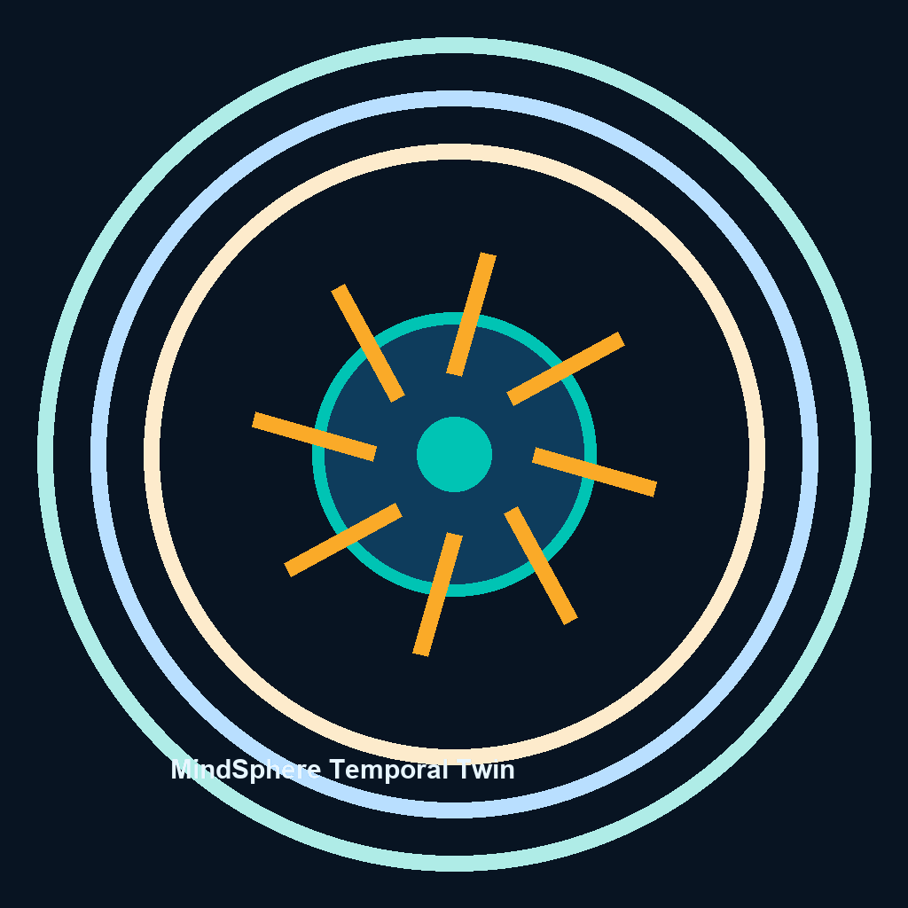
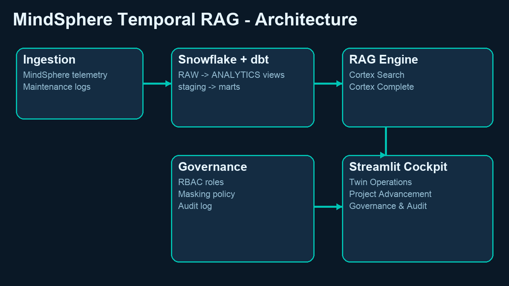
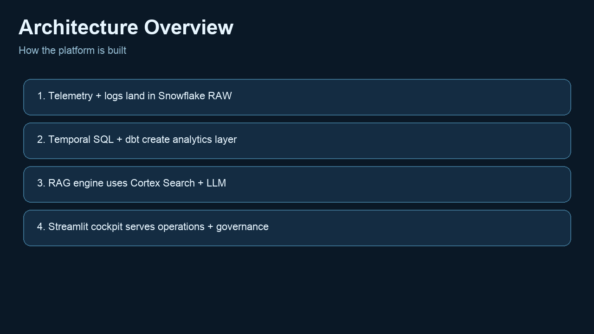
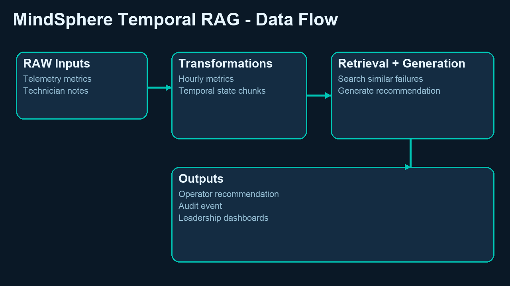
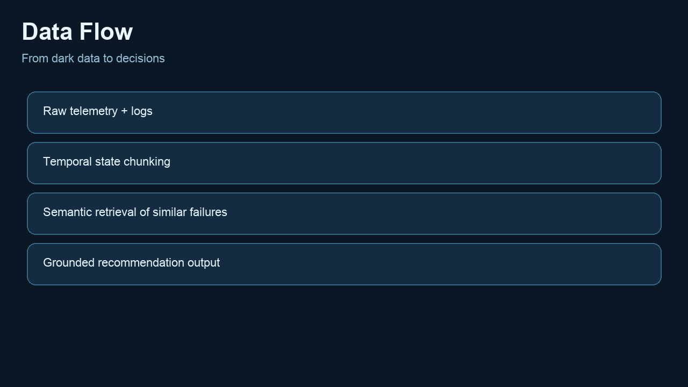
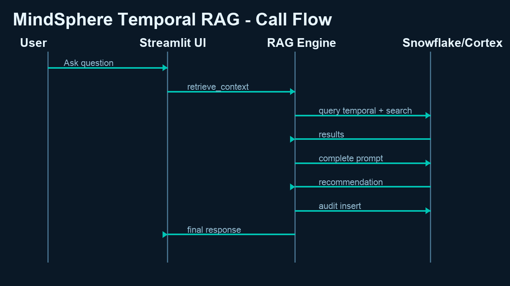
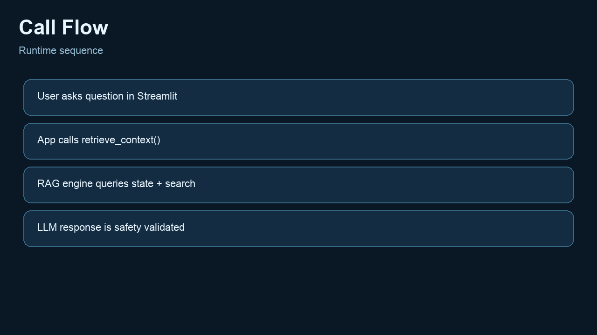
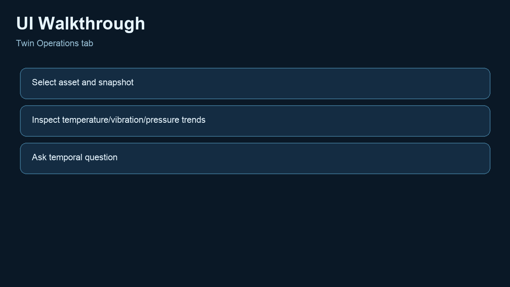

# MindSphere Temporal RAG



## Industrial Reliability Intelligence for Turbine Operations

MindSphere Temporal RAG is an enterprise-ready software platform that converts industrial dark data into closed-loop, operator-ready actions.

It fuses real-time turbine telemetry (temperature, vibration, pressure) with unstructured maintenance history to answer one critical business question:

**"What is most likely failing now, and what should we adjust immediately to prevent downtime?"**

The platform is purpose-built for Siemens MindSphere (Insights Hub) digital twin scenarios in power and aerospace environments where reliability, traceability, and actionability are non-negotiable.

---

## Why This Product Matters

### Business Problem
Industrial teams collect massive data volumes, but decision loops remain slow:
- Telemetry streams exist in one system.
- Technician logs exist in another.
- Operators manually correlate symptoms to historical failures.
- High-value intervention windows are missed.

### Business Outcome
MindSphere Temporal RAG creates a **single temporal intelligence layer** that:
- Detects risk patterns early.
- Retrieves similar historical failure narratives.
- Generates grounded control-loop recommendations.
- Enforces safety checks.
- Audits every recommendation event.

### Value Proposition for Buyers
- Reduced unplanned outages through earlier intervention.
- Faster root-cause triage for reliability teams.
- Higher operator confidence via evidence-grounded AI recommendations.
- Enterprise governance out of the box (RBAC, masking, auditability).
- Leadership visibility through a live operational cockpit.

---

## Product Visuals

### Architecture Overview




### Data Flow




### Runtime Call Flow




### UI Walkthrough


---

## End-to-End Product Flow

1. **Telemetry ingestion into Snowflake RAW**
   - Simulated MindSphere turbine telemetry is stored in `RAW.RAW_TELEMETRY`.

2. **Maintenance narrative ingestion**
   - Technician notes and error codes are stored in `RAW.MAINTENANCE_LOGS`.

3. **Temporal state modeling**
   - SQL transformations compute rolling metrics: moving average, variance, and deltas.
   - Temporal chunks are flattened for retrieval and reasoning.

4. **Semantic retrieval over historical failures**
   - Snowflake Cortex Search retrieves the nearest historical events by context similarity.
   - Vector fallback path supports robust retrieval behavior.

5. **Recommendation generation (Closed-loop Digital Twin)**
   - Retrieved context + temporal state are passed into Cortex Complete.
   - Output is structured for operations:
     - Risk Assessment
     - Component at Risk
     - Immediate Control-Loop Adjustment
     - Next 24h Monitoring Plan
     - Maintenance Follow-up

6. **Safety gate + audit**
   - Recommendation safety validation checks required sections and banned unsafe phrases.
   - Every recommendation event is written to audit logs for traceability.

7. **Operator + leadership visibility**
   - Streamlit cockpit surfaces operations, project advancement, and governance insights.

---

## Core Capabilities

### Temporal AI Decisioning
- Time-aware state retrieval from recent operating windows.
- Historical maintenance context retrieval for grounded reasoning.
- Chronological evidence chain for explainability.

### Reliability Operations
- Component-at-risk identification.
- Recommended control-loop parameter adjustments.
- Monitoring and follow-up maintenance guidance.

### Governance and Trust
- Role-based access control design.
- Column masking for sensitive maintenance notes.
- Recommendation safety validation.
- Audit logging and daily safety analytics.

### Analytics Engineering Readiness
- dbt source/staging/marts structure.
- Testable semantic data layer.
- Foundation for enterprise CI/CD.

---

## Technology Stack

- **Data Platform:** Snowflake Data Warehouse
- **Transformations:** SQL + dbt-style modeling
- **Retrieval & AI:** Snowflake Cortex Search, Cortex Complete
- **Backend Orchestration:** Python (Snowpark + RAG orchestration)
- **Frontend:** Streamlit
- **Testing:** pytest (retrieval quality + safety checks)

---

## Repository Structure

- `01_snowflake_setup.sql` - database, schema, seed data, Cortex search setup
- `02_temporal_views.sql` - temporal aggregation and chunking views
- `03_enterprise_governance.sql` - RBAC, masking, audit structures
- `backend_rag.py` - Temporal RAG engine with retrieval, generation, safety, audit hooks
- `app.py` - Streamlit application (operations + progress + governance)
- `demo_engine.py` - deterministic offline demo engine
- `demo_runner.py` - CLI demonstration script
- `dbt_project.yml` and `models/` - sources/staging/marts models
- `tests/` - unit/integration tests
- `docs/` - architecture docs, demo playbook, thesis, visual assets

---

## Quick Start

## 1) Run with Demo Data (No Snowflake Required)

```bash
cd /Users/deveshkumar/Projects/MindSphere
python3 demo_runner.py
```

Start the UI in demo mode:

```bash
DEMO_MODE=1 python3 -m streamlit run app.py --server.port 8510
```

## 2) Run with Snowflake

1. Execute SQL setup files in order:
   - `01_snowflake_setup.sql`
   - `02_temporal_views.sql`
   - `03_enterprise_governance.sql`
2. Set env vars:
   - `SNOWFLAKE_ACCOUNT`
   - `SNOWFLAKE_USER`
   - `SNOWFLAKE_PASSWORD`
   - `SNOWFLAKE_WAREHOUSE`
   - `SNOWFLAKE_ROLE`
3. Launch app:

```bash
python3 -m streamlit run app.py
```

---

## Sales Demo Narrative (Leadership-Ready)

Use this sequence for customer-facing walkthroughs:

1. Show architecture GIF and discuss system-level trust boundaries.
2. Show data flow GIF and explain dark-data conversion to operational evidence.
3. Run a live query in Twin Operations tab.
4. Show recommendation structure and historical evidence.
5. Open Governance tab and show safety status + audit logs.
6. Close with measurable value: reliability uplift, outage avoidance, decision latency reduction.

Detailed script:
- `docs/LEADERSHIP_DEMO_PLAYBOOK.md`

---

## Security and Enterprise Controls

- Role isolation for admin, engineer, operator, auditor personas.
- Sensitive maintenance text masking policy.
- Recommendation safety policy enforcement.
- Auditable recommendation events and daily governance analytics.

---

## Product Positioning

MindSphere Temporal RAG is ideal for organizations seeking:
- Reliability-centered operations modernization.
- Explainable AI in safety-sensitive industrial workflows.
- Fast path from pilot to production with governance-by-design.

If your teams are currently correlating sensor spikes and maintenance history manually, this product shortens the loop from **hours to minutes**.

---

## Documentation

- Project documentation: `docs/PROJECT_DOCUMENTATION.md`
- Visual assets index: `docs/VISUAL_ASSETS.md`
- Thesis document: `docs/MindSphere_Temporal_RAG_Thesis_Medium.docx`
- Leadership playbook: `docs/LEADERSHIP_DEMO_PLAYBOOK.md`

## Governance and Commercialization Documents

- License: `LICENSE`
- Copyright notice: `docs/governance/COPYRIGHT_NOTICE.md`
- Patent and IP notice: `docs/governance/PATENT_AND_IP_NOTICE.md`
- Innovation and invention profile: `docs/governance/INNOVATION_AND_INVENTION_PROFILE.md`
- Product purpose: `docs/governance/PRODUCT_PURPOSE.md`
- Requirements specification: `docs/governance/REQUIREMENTS_SPECIFICATION.md`
- Scope of work: `docs/governance/SCOPE_OF_WORK.md`
- Quality assurance document: `docs/governance/QUALITY_ASSURANCE_DOCUMENT.md`
- Risk management document: `docs/governance/RISK_MANAGEMENT_DOCUMENT.md`
- Product classification and skills certification: `docs/governance/PRODUCT_CLASSIFICATION_AND_SKILLS_CERTIFICATION.md`
