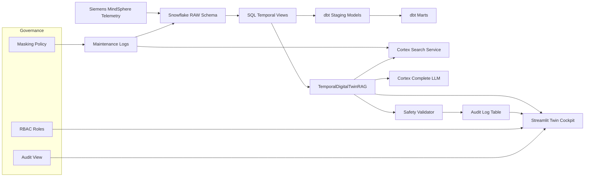

# Architecture Diagram

```mermaid
flowchart LR
    A[Siemens MindSphere Telemetry] --> B[Snowflake RAW Schema]
    C[Maintenance Logs] --> B
    B --> D[SQL Temporal Views]
    D --> E[dbt Staging Models]
    E --> F[dbt Marts]
    D --> G[TemporalDigitalTwinRAG]
    C --> H[Cortex Search Service]
    G --> H
    G --> I[Cortex Complete LLM]
    G --> J[Safety Validator]
    J --> K[Audit Log Table]
    G --> L[Streamlit Twin Cockpit]
    K --> L

    subgraph Governance
      M[RBAC Roles]
      N[Masking Policy]
      O[Audit View]
    end

    M --> L
    N --> C
    O --> L
```
