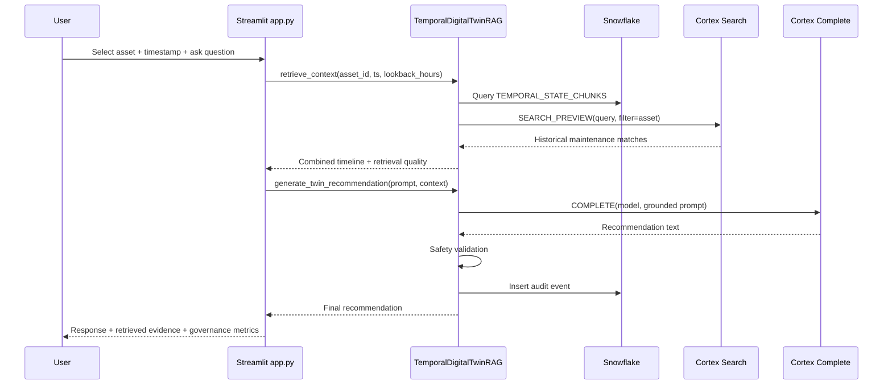

# Call Flow Diagram

```mermaid
sequenceDiagram
    participant User
    participant UI as Streamlit app.py
    participant RAG as TemporalDigitalTwinRAG
    participant SF as Snowflake
    participant CS as Cortex Search
    participant LLM as Cortex Complete

    User->>UI: Select asset + timestamp + ask question
    UI->>RAG: retrieve_context(asset_id, ts, lookback_hours)
    RAG->>SF: Query TEMPORAL_STATE_CHUNKS
    RAG->>CS: SEARCH_PREVIEW(query, filter=asset)
    CS-->>RAG: Historical maintenance matches
    RAG-->>UI: Combined timeline + retrieval quality
    UI->>RAG: generate_twin_recommendation(prompt, context)
    RAG->>LLM: COMPLETE(model, grounded prompt)
    LLM-->>RAG: Recommendation text
    RAG->>RAG: Safety validation
    RAG->>SF: Insert audit event
    RAG-->>UI: Final recommendation
    UI-->>User: Response + retrieved evidence + governance metrics
```
